# Account Access and Agent set up

We are going to set up a full environment onto your machines. You will learn about the Bodhi Store, Bodhi Mobile, Bodhi Agent and Bodhi Agent apps in this workshop.

If you have any questions while working through these instructions, please reach out to the HotSchedules Customer Care team at +1 866.753.3853 or CustomerCare@HotSchedules.com

## Getting started

This part of the workshop will cover all the tasks required to get your environment ready. The lab exercises are as follows:

* Verify your login credentials
* Ensure you can access Bodhi Tools
* Install Bodhi Mobile
* Set up a store
* Download the Bodhi Agent


Before starting the installation on your machine - please verify the following websites are unblocked or whitelisted with your proxy server or service provider:

* https://api.bodhi.space/
* https://rbcplatform.artifactoryonline.com/


## Checking your account and user access

We call accounts in Bodhi **namespace**. In our examples we use an account called 'reveal'. So when you see a reference to namespace in any examples, replace this with your own account name.

You should each have received a user account account for your namespace.

All of Bodhi's tools are web based and have been designed to take advantage of modern devices and browsers. It is recommended that you use Google Chrome or Firefox to access Bodhi Tools. Using the latest version of IE is also supported.

In your browser go to into https://tools.bodhi.space/ 

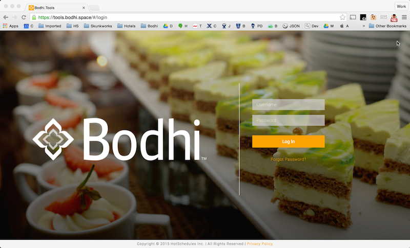

Enter your user credentials. If your account has been set up, you should be able to log in. 

If you have forgotten your password, click the forgot password link and a Reset password link will be emailed to you at the email address associated with your user account.

On successful log in, you should see the following landing page:

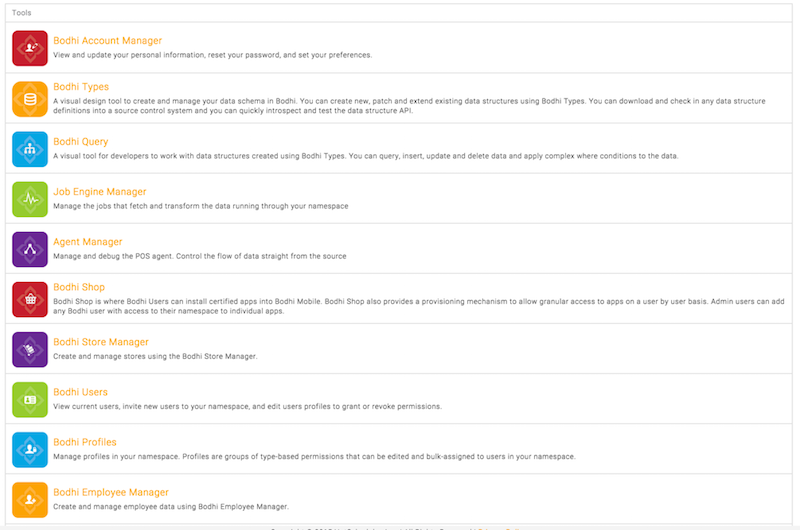


We will cover the tools throughout the workshop. For now, we have determined that you have a Bodhi account and are able to access your account successfully. 


## Setting up a Store

To get started we will need to add a new Store to the namespace. Scroll down to **Bodhi Store Manager** to launch the Bodhi Store tool.


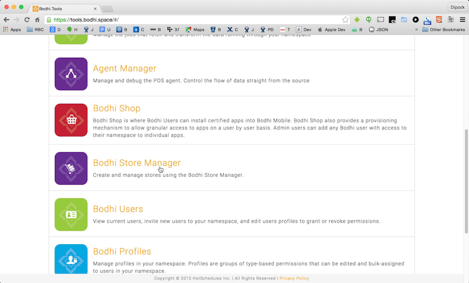

The first time you run Bodhi Store, the display will be empty. (In this example we have several stores set up already).

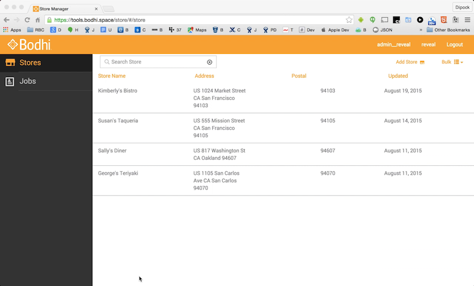

To add a new store, click 'Add Store'.

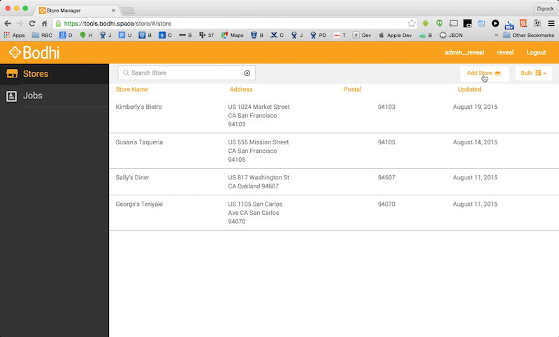

There are several madatory fields required for all stores. These are:

* Store name
* Store display name 
* Store number
* Timezone

Although not mandatory - it is also important to set the **currency** for the store.

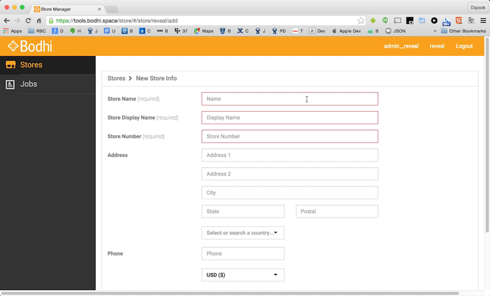

Fill out the form for the store. Be sure to populate as much information as you can especially for the address as this is used for location based searches - for example to determine the weather or traffic alerts for the store location.

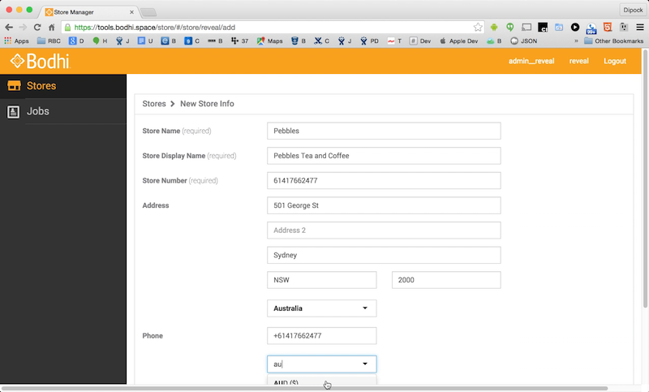

Be sure to populate the currency and the timezone for the store.  

Date and time values in Bodhi are stored in UTC format and timezone offsets are used to determine the correct time values in applications.  

Currency is required to ensure that the right currency symbol is used in applications and currency conversions are applied for single currency reporting when stores are located in different countries.

Once you have completed the form, click 'Add Store'.

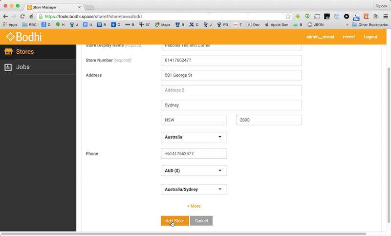

A confirmation dialogue will be displayed if the data was submitted correctly and a store was created. If there are any errors, this will be reported at this point and you will have to correct the errors before trying to submit the form again.

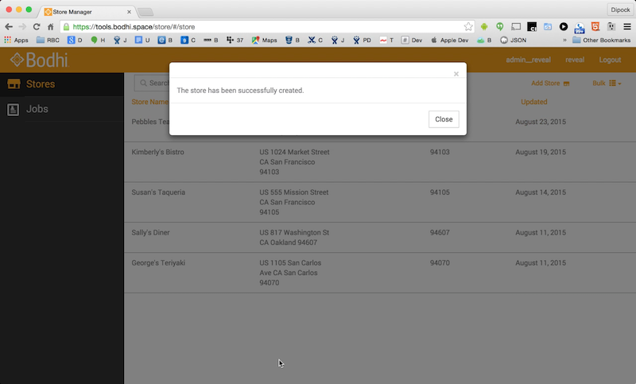

Once the store is created, it should be visible in the list of stores. You can add as many stores as you wish using this tool. If you have many stores, then it is recommended that you use the Bodhi bulk import tool to create those stores. That is beyond the scope of this lab.

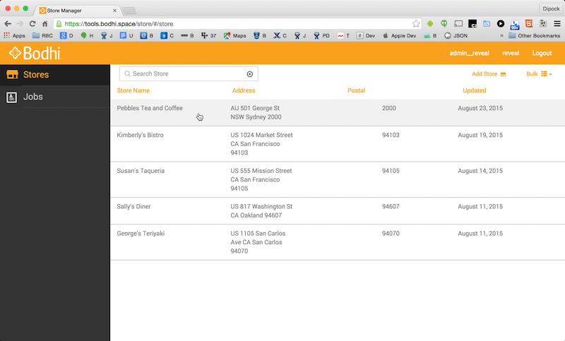


## Installing Bodhi Mobile

Now we will install Bodhi Mobile from the app store.  

From your iPhone launch Apple Store or from your Android Phone launch Google Play.  
Search for **Bodhi Mobile**. Bodhi Mobile is an app that allows you to host and launch several apps from your Bodhi account.

Once you have found Bodhi Mobile, install the app.


Once installed, launch Bodhi Mobile. At this stage you will not have any apps in your account yet, but you can log in. If any apps had been assigned to you, each app would presented in the menu options.

Log into the app to verify your credentials work. Enter the same credentials you used when you logged into Bodhi Tools.  

On successful log in, you should see a menu with only two options

* Settings
* Logout

Bit diappointing isn't it? Don't worry we will add some apps in a minute.


## Adding the Agent Registration app

All applications, whether mobile, agent or server side jobs, are added to your account using the Bodhi Shop tool. 

From your desktop browser, log into Bodhi Tools at https://tools.bodhi.space/. 

Scroll down to Bodhi Shop and click to launch.

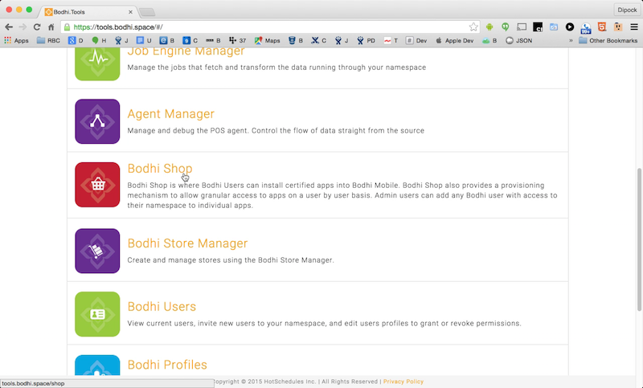

When you first run the application, you will be taken to the default view which shows you the apps that have been deployed into your account. 
If this is the first time anyone has run Bodhi Shop on your account, you will see that there are no apps deployed. 


Click the 'Mobile Apps' link to navigate to the Global (public) Bodhi Shop.

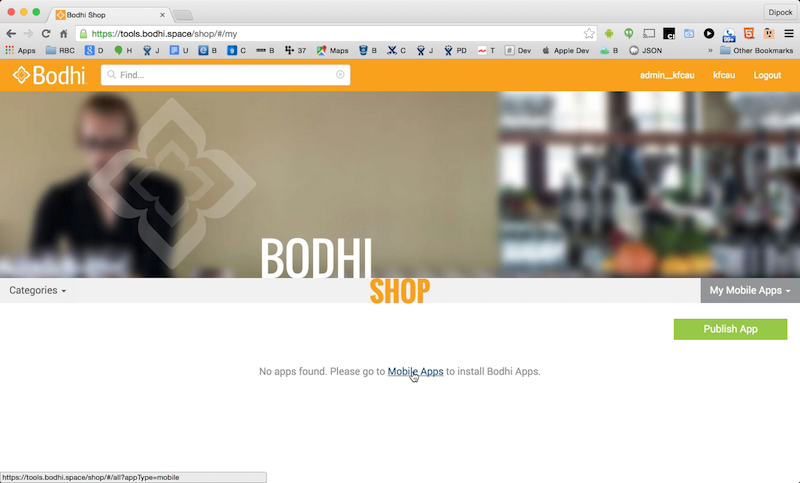

In the public Bodhi shop you can see the mobile applications that are available for installation into your account. 

If you want to review an app before installing it, just click on the app logo to view the app details. 

If you want to add an application to your account just click the Install button. When the app has been added to your account, you will be take to the detail page for that application. 

Look for the **Agent Registration** app and then click the Install button to add the application to your namespace. 

**Note:** The Agent Registration app is used to pair an agent with your namepsace during the configuration of a namespace.


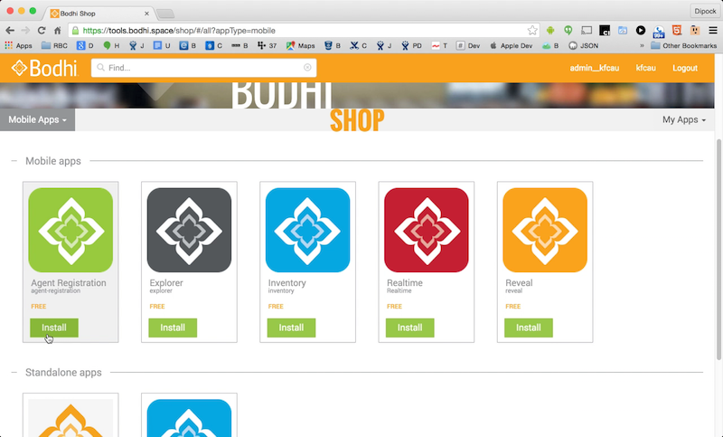

At this point you could install more mobile applications into your namespace - but for now we will just click on the **My Apps** link on the right hand side of the screen to navigate back to your account.

Now you can see that the Agent Registration app has been installed in your namespace. By default, all apps are added with one user assigned - this is the primary admin user on the account. 

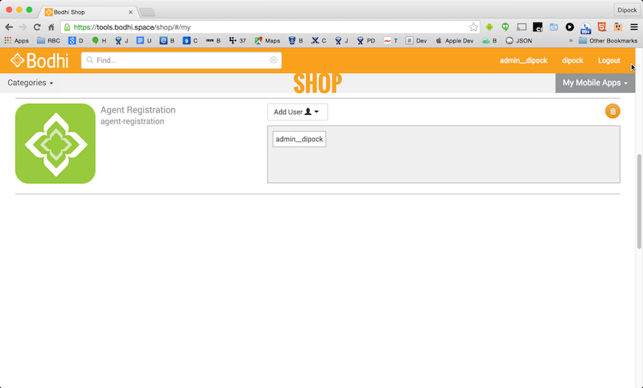

To add more users to the account click the **Add User** drop down and select the users that require access to this application. For the Agent Registration app, this will be anyone who will be installating and pairing an agent with your account.


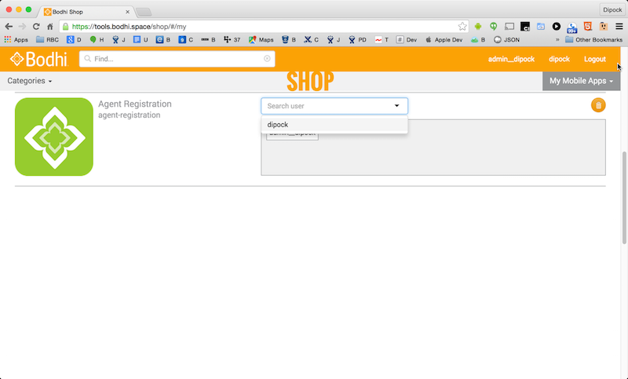


## Check Agent Registration on your device

On your mobile device, launch Bodhi Mobile. If the app was open from the last exercise, log out of the app and then log in. Doing this forces Bodhi Mobile to check with the server and quickly detect that there is an app waiting to be added to your device.

Once you log in, you should see a new application on your device, the **Agent Registration** app.


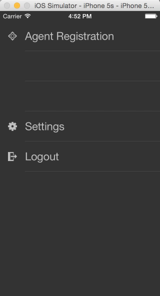


## Agent set up

Now you are ready to install the Bodhi Agent. Once the agent is installed you will need to use the Bodhi Agent mobile app to pair the agent with the Store you set up earlier.

You can download the Bodhi agent software installer from the secure Bodhi repository. The latest agent installation files are located here:

**32-bit machine** <https://rbcplatform.artifactoryonline.com/rbcplatform/hotlinik-release/BodhiAgentSetup-0.4.14-x86.exe>

**64-bit machine**: <https://rbcplatform.artifactoryonline.com/rbcplatform/hotlinik-release/BodhiAgentSetup-0.4.14-x64.exe>

Be sure to download the right version for your operating system.   
**Note:** For Mac and Linux installations please contact HotSchedules support.

Once downloaded, run the BodhiAgentSetup program.

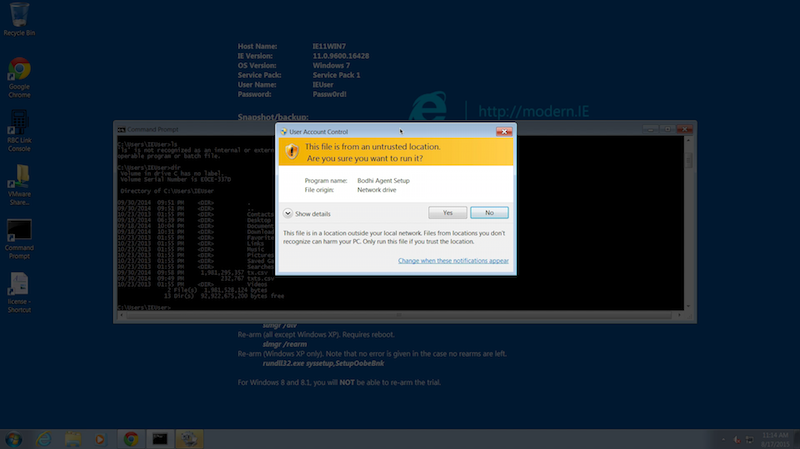

Click 'Yes' to run the application.

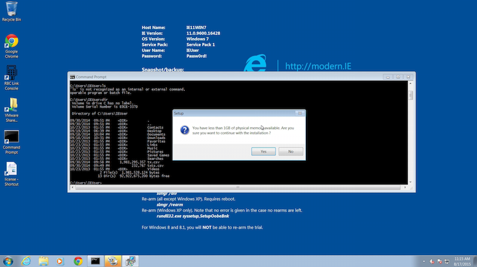

The installer will carry out a memory check. Just click 'Yes' to carry out the installation. (Note: The agent does not need 1GB of memory to run).

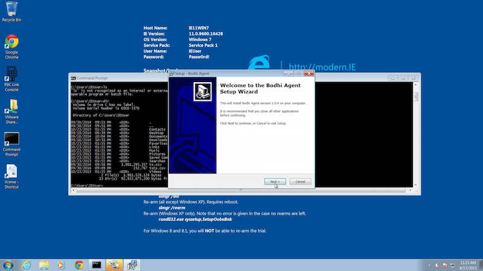

Click Next.


Once you have read and approve of the License agreement, click 'I accept the agreement' and then click Next.


Make a note of the installation location. Click Next to set up the agent in the default location. 


Click Next to add the agent to the Start Menu folder.

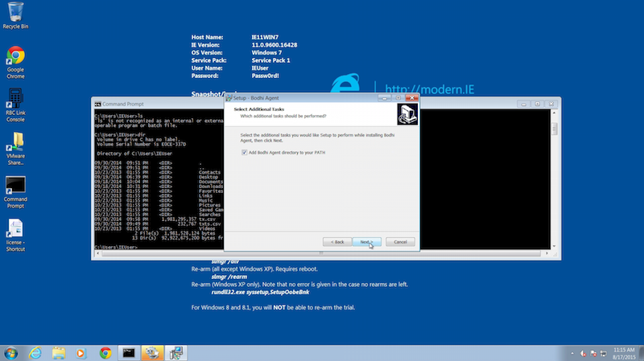

Click Next to add the agent to your PATH.


Review the Installation settings. If you are satisfied with the settings, click Install to install the agent.

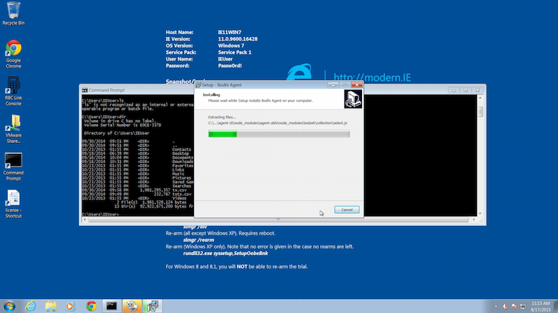

The setup program will install the Bodhi Agent. During installation, the setup program will check to see if **node.js** is installed on the machine. This is the only dependency for the Agent application to run. The agent does not use or require the .NET framework or any 3rd party distributables.  

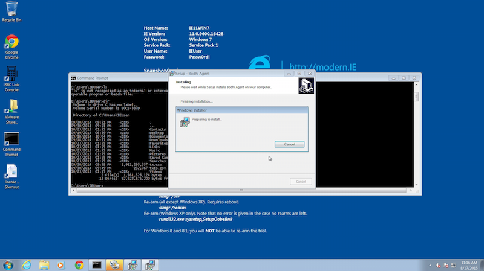

If the setup program does not find node.js, the setup program will install node.js 

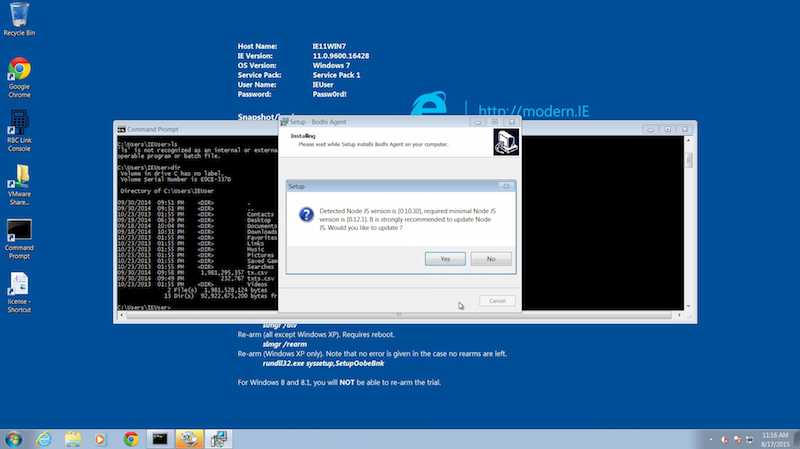

If the setup program finds node.js, but the version required does not meet the minimal version required for the agent to run, the setup program will ask you to upgrade node.js. It is recommended that you do this - but also makes sure that other applications installed on the machine requiring node.js are compatible with the latest node.js version. 

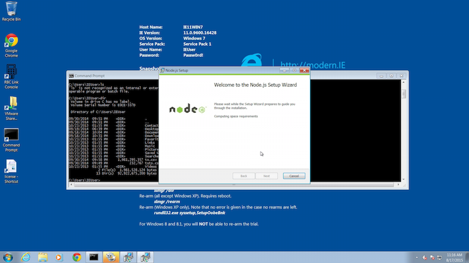

The setup program will launch the native node.js installer. Click Next to continue.

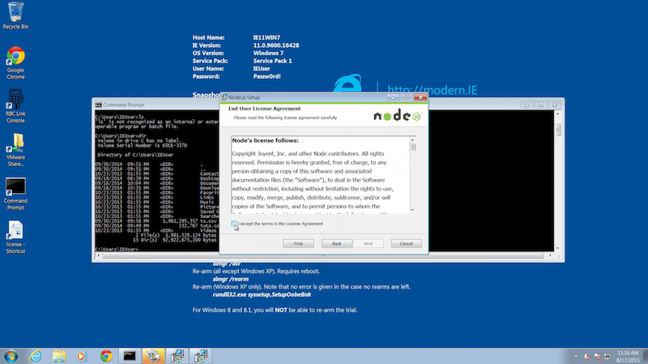

Once you have reviewed and approved the node.js license agreement, select 'I accept the terms of the license agreement' and click Next. 

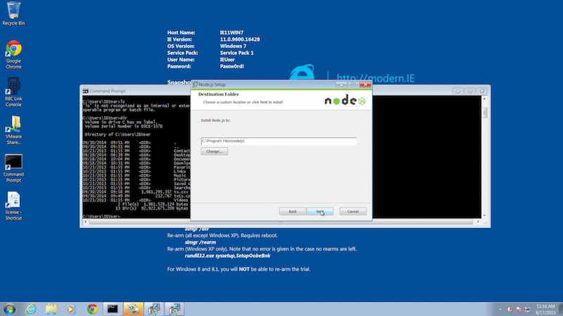

Click Next to install node.js in the default location.

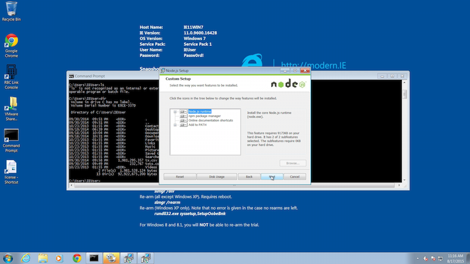

Click Next to accept the default options to install.

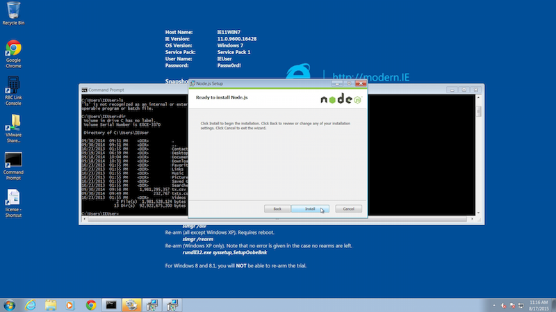

Click Install to install node.js to your machine.

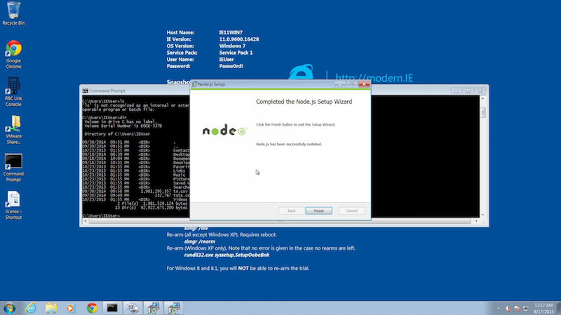

Click Finish to complete the setup on your machine.

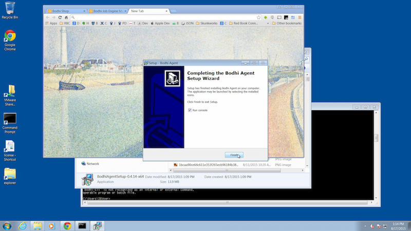

Once the installation completes, the agent app will start up a console window and launch the Agent manager console in your default web browser. 


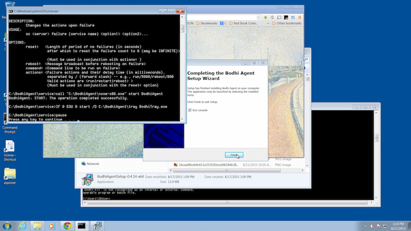

The Agent manager console displays the health status of the Agent, in your browser.

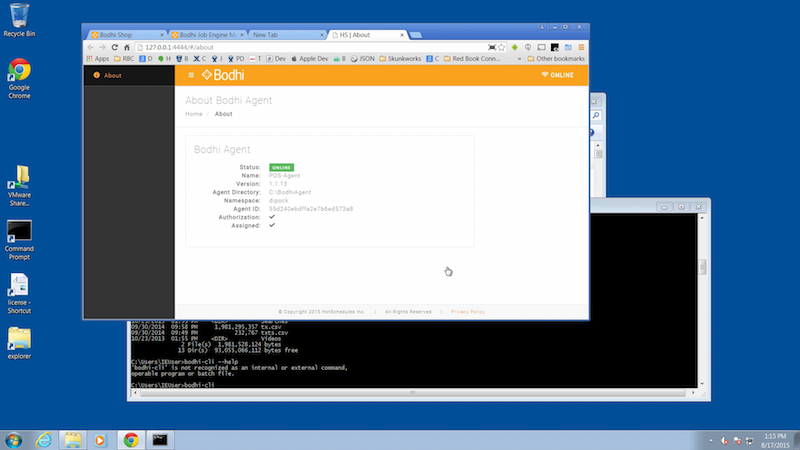

If for some reason the console does not appear open a command shell or terminal and enter 
```` 
agent-cli console 
```` 
to launch the console app on <http://127.0.0.1:444>

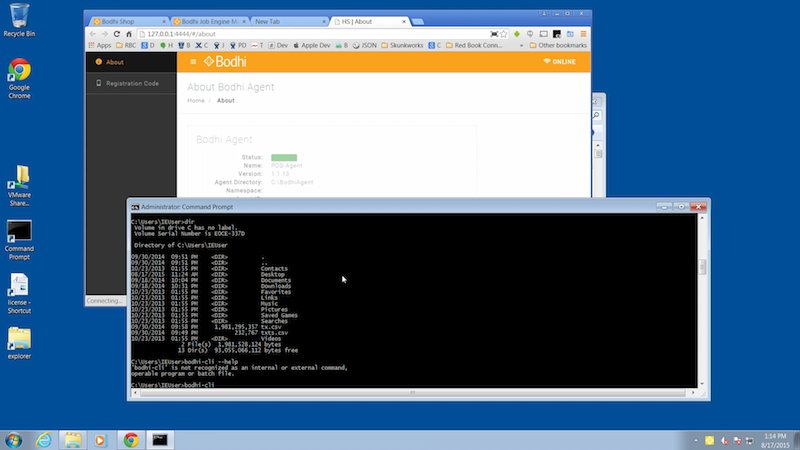

Once the agent has finished diagnostic tests, a registration code will appear.   
**Do not** click the OK button. You will need the registration code for the final step of Agent setup.

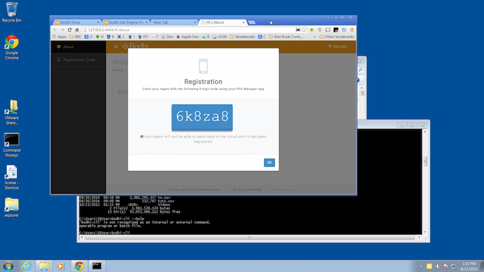

Note: if you are using the command line and do not want to register the application using the web based agent console - you can create a registration token entering the following in the command line

````
agent-cli registration
````


## Agent Setup using Silent Install

The latest versions of the Agent set up now include a silent install option for  software distribution applications and remote installation.

**64-bit machine**: https://rbcplatform.artifactoryonline.com/rbcplatform/hotlinik-release/BodhiAgentSetup-0.4.55-x64.exe

**32-bit machine**: https://rbcplatform.artifactoryonline.com/rbcplatform/hotlinik-release/BodhiAgentSetup-0.4.55-x86.exe


Once downloaded on the target machine or image, open the command line as an administrator, go to the directory where the install packaged was downloaded and enter:

````
BodhiAgentSetup-0.4.35-x64.exe /VERYSILENT
````
or

````
BodhiAgentSetup-0.4.35-x86.exe /VERYSILENT
````


## Connect the agent with your namespace

Now you are ready to pair the agent with your Store. To do this your will use the Agent Registration app you have installed on your device. 

On your mobile device, launch Bodhi Mobile and login. 
Launch the Agent Registration mobile app by tapping the menu option.


The Agent Registration app will show you all the Agents that have bee paired with stores. If this is the first time you are pairing an agent with a store, then the app will tell you No POS systems are paired yet.

To add an agent, tap the + symbol in the header bar. 

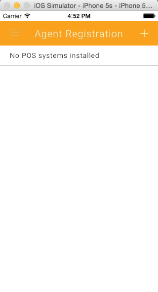

From the list of stores displayed, select the store that you want to pair your agent with. 

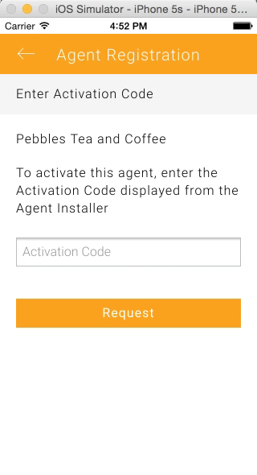

Once the store has been selected, enter the Activation code you see on the screen of your desktop. If you selected the wrong store - just tap the back arrow to go back to the previous screen and select the correct store.

If you have entered the Activation Code, tap the Request button. 


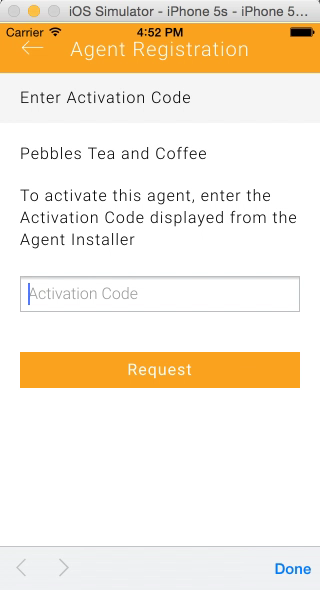

The mobile app will submit the code to Bodhi Cloud. The cloud will recognise the agent code and associate the store with the agent that has presented the same pairing code. Once paired, the Agent manager console status should update and you should see a Success message. Click OK.

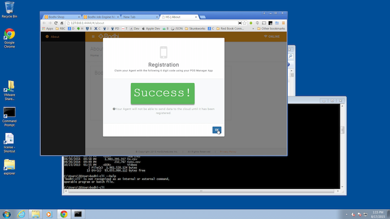

The agent console should now show that the Agent has been Assigned (to a store).


By default, the agent does not run any business logic. To do that you must install Bodhi Agent apps using Bodhi Shop. Before we do that, we will explore some of the other features of the Bodhi Agent. 


## Agent features

The Bodhi agent comes with a slew of features that can help you understand the setup, status and issues that may be occuring with the Bodhi Agent.

To start, launch a command Prompt or Terminal shell. You need to run command prompt as an Administrator.

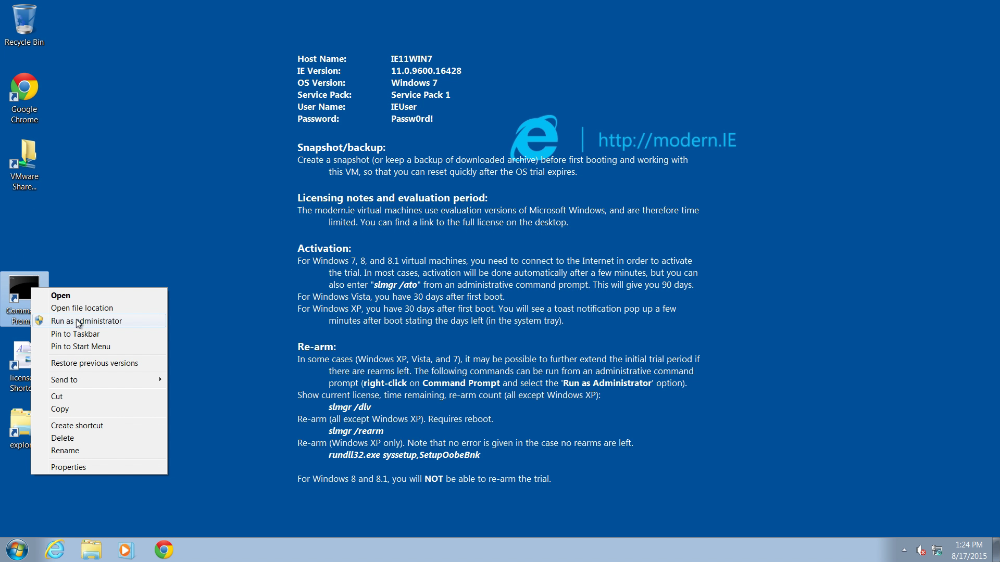

Click Yes when asked to allow Command prompt to run as an administrator.

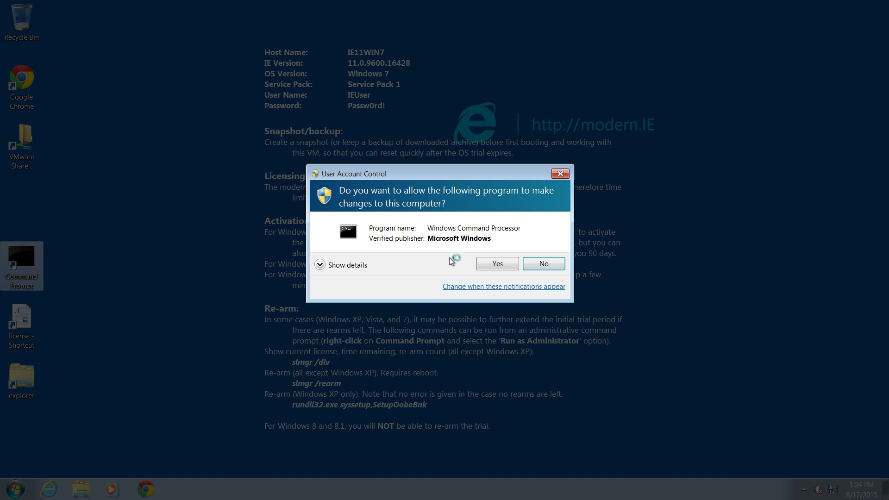

First let's check the status of the agent. At the prompt enter 

````
agent-cli status
````

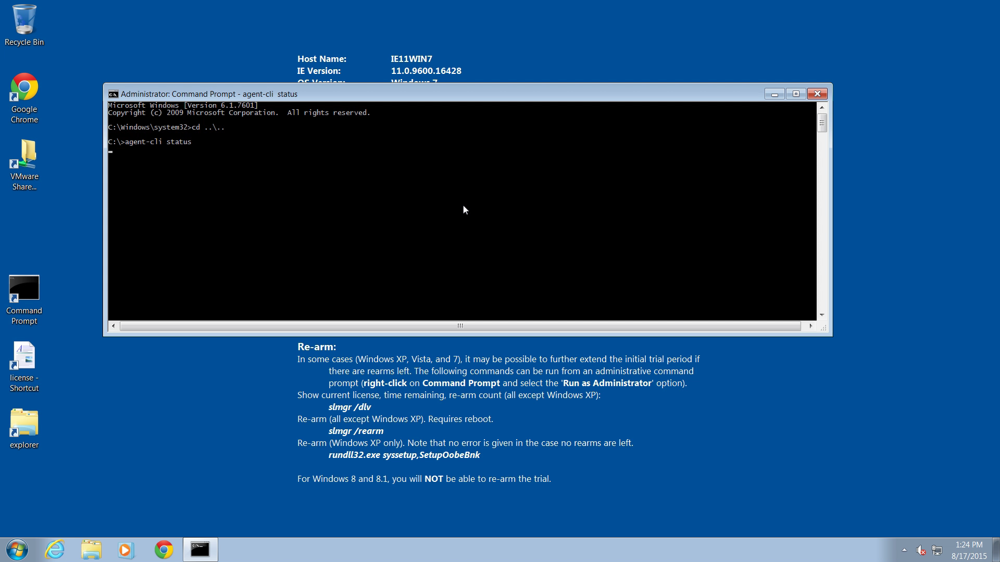

The Bodhi agent will respond and display the health of the agent.


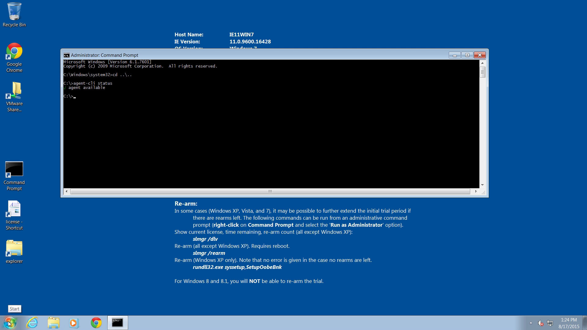

Now let's review the configuration data for the agent. At the prompt enter 

````
agent-cli view
````

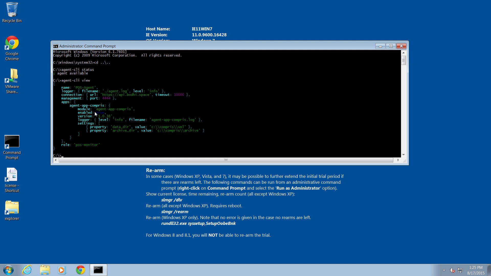 

All of the agent configuration information is displayed.

To view and try other agent commands type

````
agent-cli --help
````


## Agent maintenance 

Athough not part of the workshop, there are several other items you should be aware of. At times it is necessary to update the agent-cli, agent-core or agent drivers. 

The following commands update the agent-cli to a specific version (1.4.22), agent-core, agent drivers and then force the agent to restart. 

````
agent-cli update agent-cli@1.4.22
agent-cli update agent-core
agent-cli update bodhi-driver-superagent
agent-cli restart
````


## Adding an Agent application

Now we need to add the agent application to run in the Bodhi Agent.

All applications, whether mobile, agent or server side jobs, are added to your account using the Bodhi Shop tool. 

From your desktop browser, log into Bodhi Tools at https://tools.bodhi.space/. 

Scroll down to Bodhi Shop and click to launch.


In Bodhi Store, click **My Agent Apps**. This should display the agent apps you have installed in your environment. Just as with the mobile apps page, there should not be any agent apps deployed in your environment if this is the first time you have clicked through to the Agent apps page.

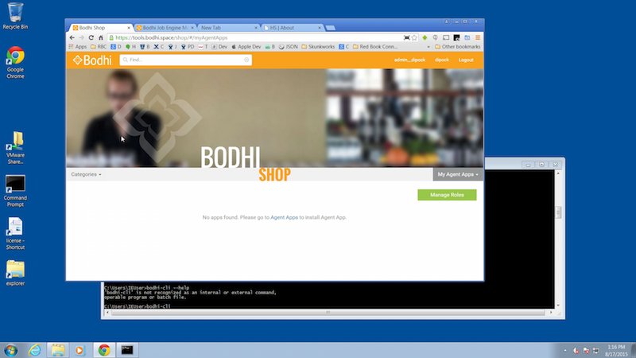

To add the Agent app, click on the Categories menu option, then click Agent Apps.


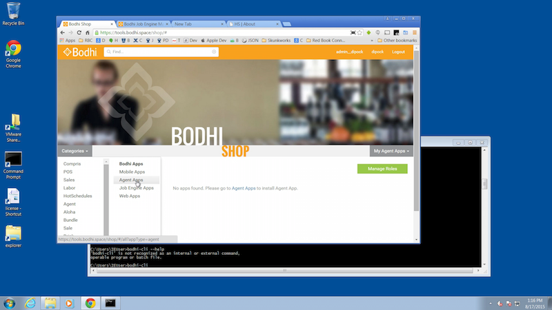

The public Bodhi Agent Apps Shop is displayed. Look for the **Hotschedules for Compris app** and click Install to install the application.

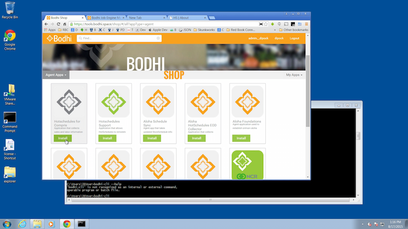

A warning message will be displayed. This informs you that additional changes will be made to your namespace inorder for the Agent app to function correctly. Click Continue.

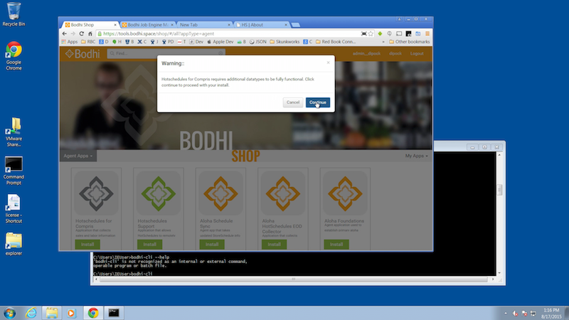

A dialog is displayed. The agent app needs to be configured with the location of the Compris Agent XML files. It is worth double checking this information on your machine.

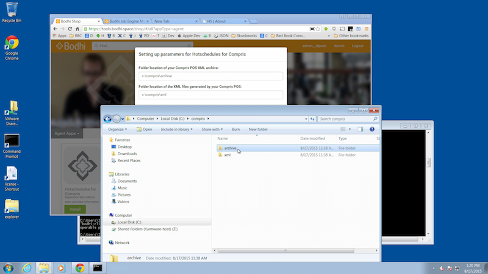

Once you have verified the location of the Compris POS files, enter the values in the dialog and then click Continue.

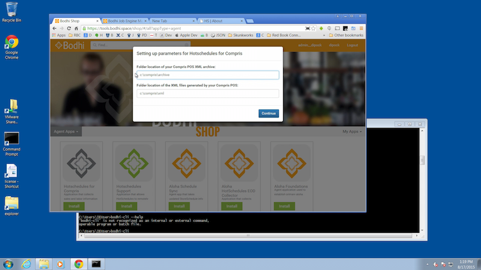

A popup will tell you what new data structures will be added to your account for the application to work. You should make a note of these structures (either copy the text to a text editor or take a screenshot). These data structures will be used in a later exercise to validate the data flow from the POS to your namespace.

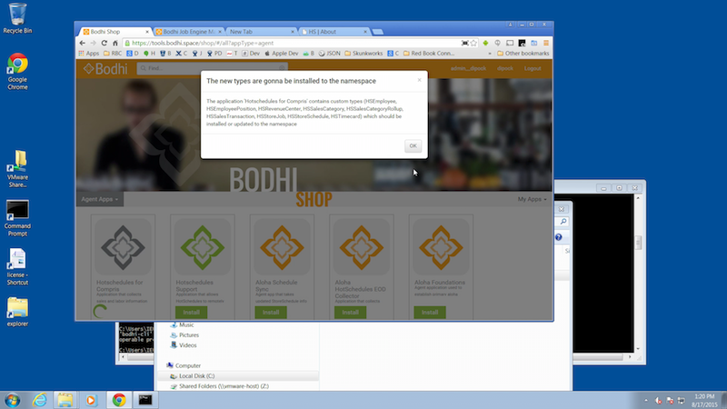

The agent app configuration page is displayed when the agent app has been added to your namespace.

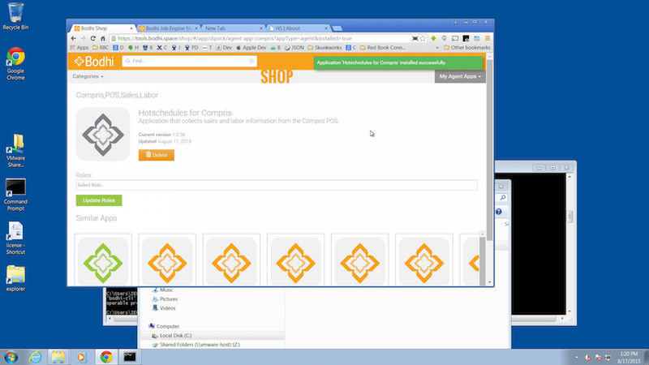

In the drop down entitled **Roles**, select **pos-monitor**.

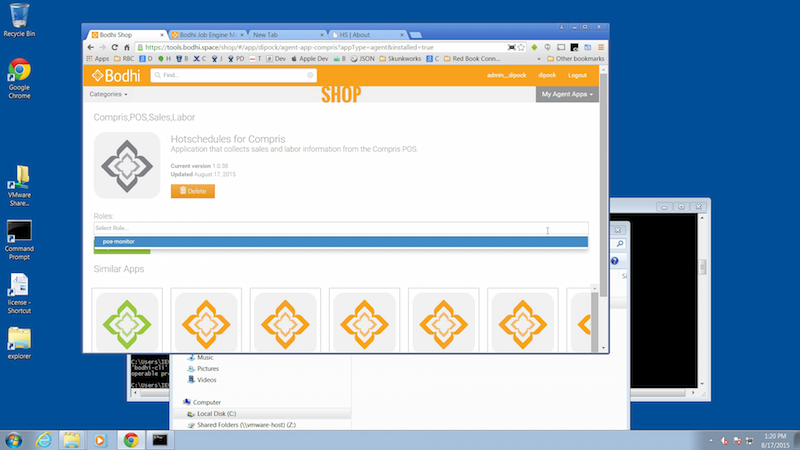

Click Update Role.

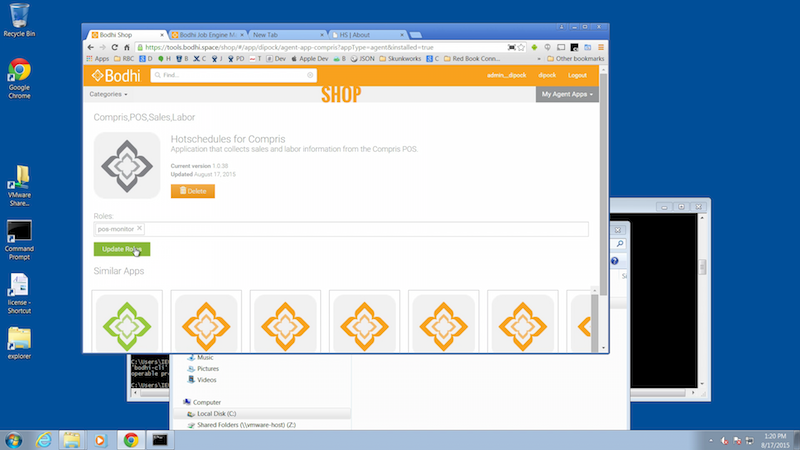

Click My Agent Apps.


Verify that the Agent app is deployed in your namespace and has been assigned the role **pos-minitor**

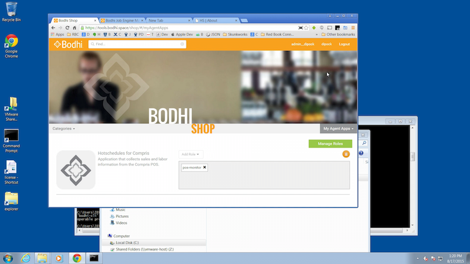


## Adding an Agent app from the Command line


bodhi me

bodhi get resources/Store?fields=display_name,sys_id

agent-cli install aloha-app-grinder
agent-cli download aloha-app-grinder
agent-cli download aloha-app-store

agent-cli download aloha-app-transactions
agent-cli download aloha-app-eod
agent-cli install-app aloha-app-eod


## Verify the Agent app is running in the agent

Now we need to verify that the agent application has been deployed and is running in the Bodhi Agent.

From your desktop browser, log into Bodhi Tools at https://tools.bodhi.space/. 

Scroll down to Agent Manager and click to launch.


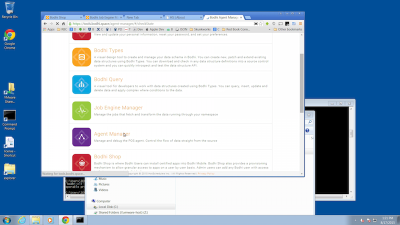

The agent manager console is displayed. This dashboard shows te status and health of all of the agents deployed in your stores.

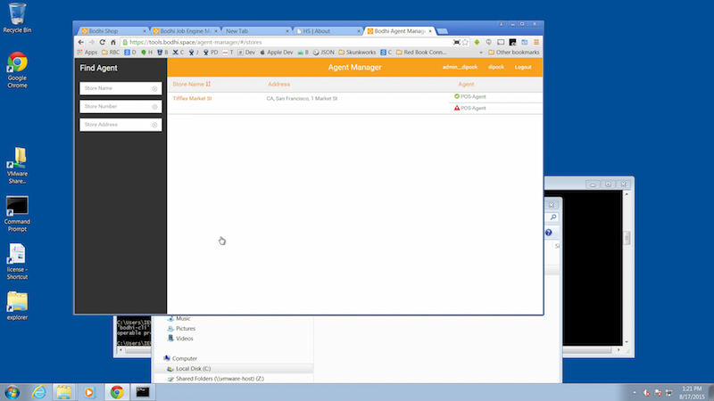

Select your store from the list of stores displayed.

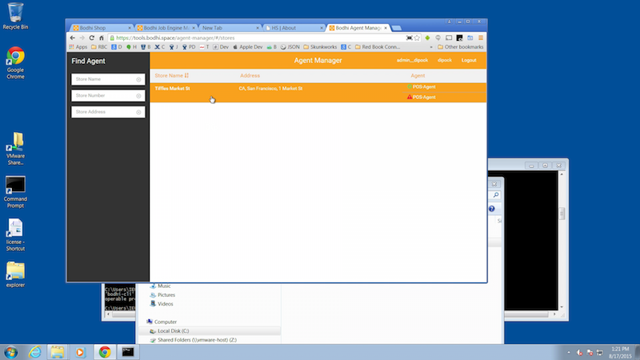

Verify the Status of the agent. The agent should be online.

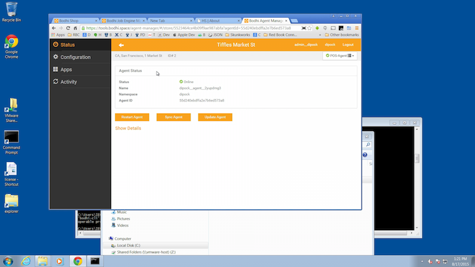

Now click configuration. If role and timezone are not set, then enter the correct values now.

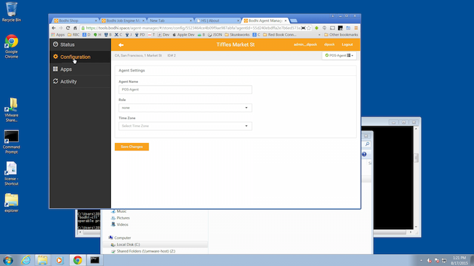

Select **pos-manager** for role.
Pick the correct timezone based on the store location associated with the agent.

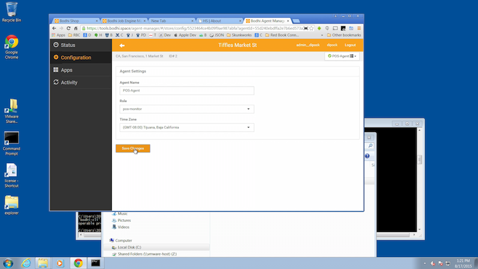

Click Save Changes. Now click Apps.

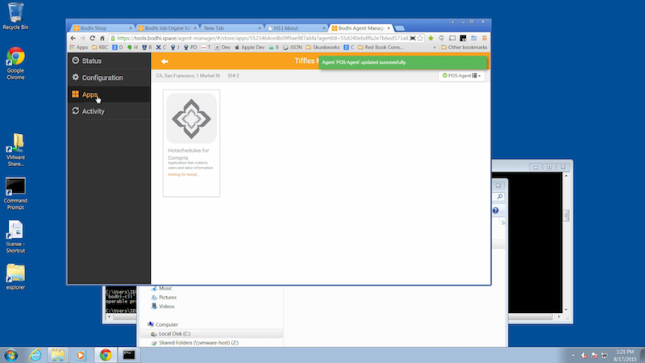

The HotSchedules for Compris POS app should be displayed. The status may say 'Waiting to install'. The status should update momentarily. In some cases it is necessary to stop and then restart the agent. In extreme cases it may be necessary to reboot the machine. In those cases a reboot will also restart the agent on your behalf.


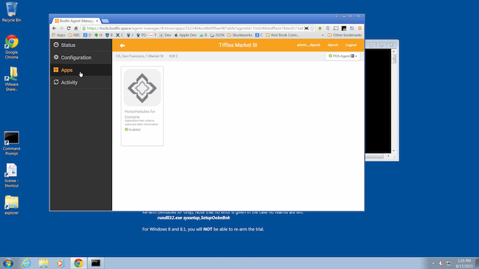

When the agent app has been installed - the status displayed on the Agent app page should say 'Enabled'.

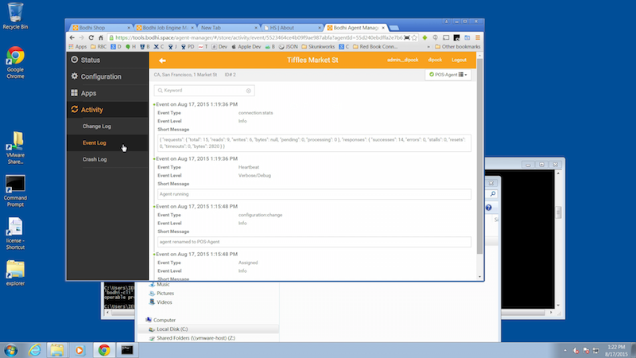


  


 