# Webhooks

A WebHook is an HTTP callback: an HTTP POST that occurs when something happens. A web application implementing WebHooks will POST a message to a URL when certain things happen.

There are two labs covered here.  
 
1. The first lab sets up a webhook to call an endpoint. The objective is to understand the webhook setup process with a low amount of effort.      
2. The second lab sets up a webhook to call a service that accomplishes a task (sends a push notification to your device) - which is more involved but is a likely use case scenario that you will deploy in your account.


# Lab 1: "Hello World" Webhook

## What this lab does

1. Set up a webhook to watch a data type for Inserts
2. Trigger the webhook to Post a message to an endpoint.


## Pre-requisites

A data type that you plan to watch. In this workshop I use a simple type I created called "Slog" (from "Captain Slog" ..) that has two string properties - application and message. (It's a useful type for capturing debug messages).

````  
Type: Slog {
			 application: String,
			 message: String
			}  

````

### Step 1 - set up the endpoint

We will use Requestb.in to provide the endpoint we want our webhook to call. It's a free service that is perfect for our use case. Open a browser and navigate to [Requestb.in](http://requestb.in/). 

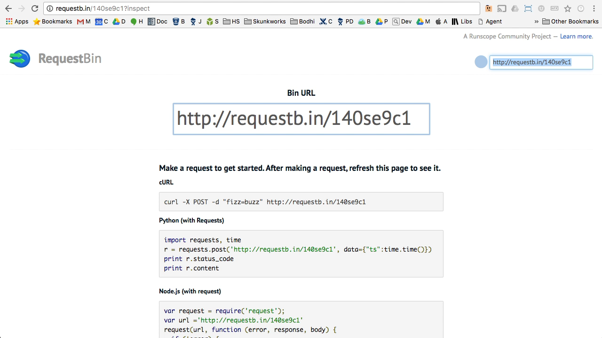

Requestb.in will provide a unique URL that you will call when the webhook fires. Copy the URL endpoint to the clipboard. (Do not copy the one shown in the screenshot).
Don not close the browser window - you need to keep this requestb.in endpoint active. 


### Step 2 - set up the webhook

Open a new browser tab.   
Log into the HotSchedules IoT Platform admin console and navigate to the Webhook management tool [located here](https://tools.bodhi.space/script-manager/#/webhooks). Click "New Webhook" located mysteriously on the Upper right hand side of the screen.

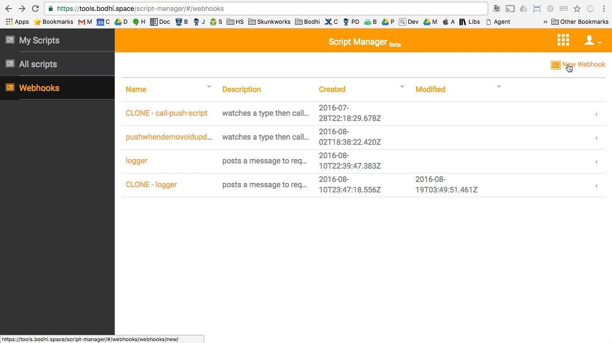

Enter a name for your webhook. 

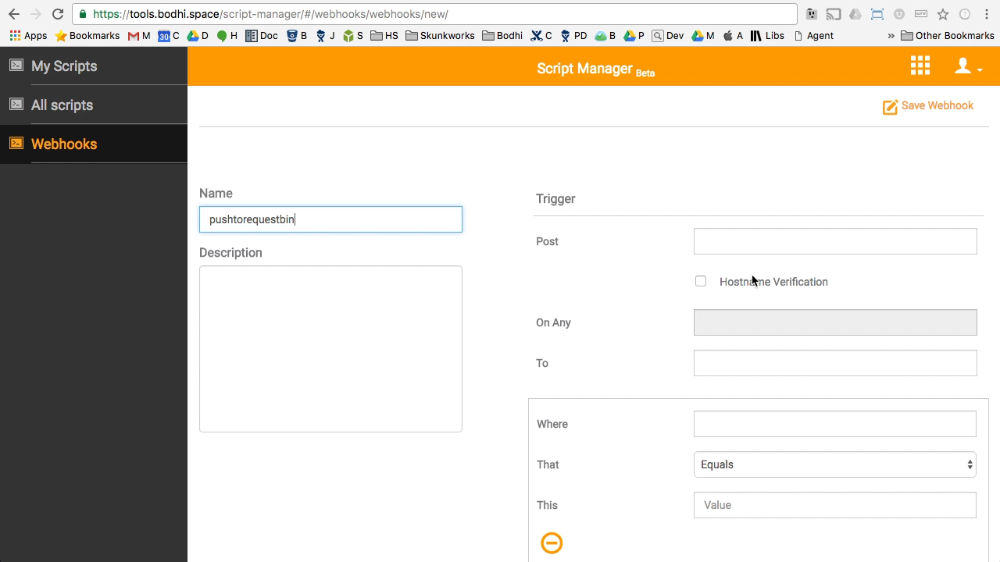

In the **Post** field, paste the requestb.in end point you copied earlier.

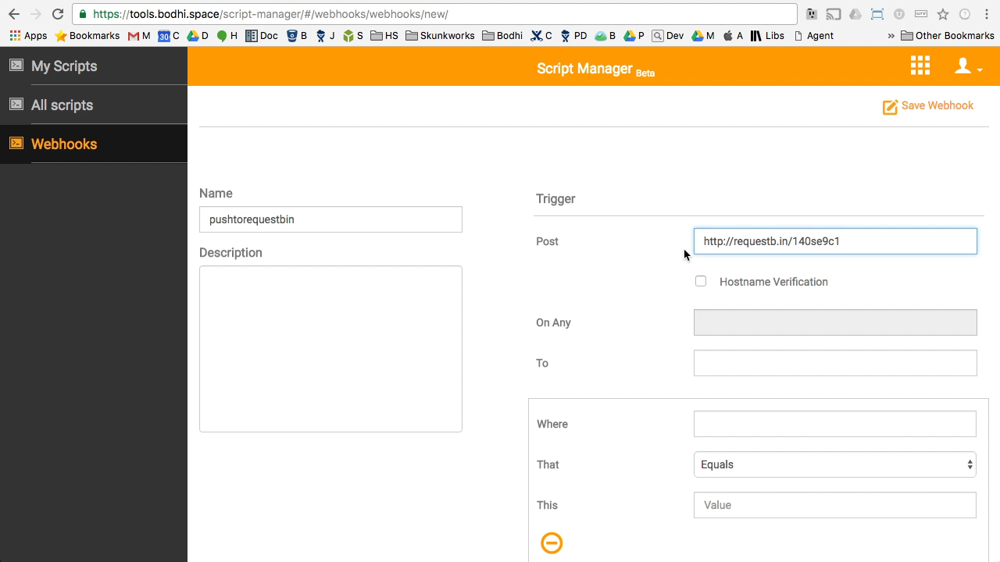

In the **On Any** field, pick "Insert". We want our webhook to fire when we insert new data into the type we want to watch.

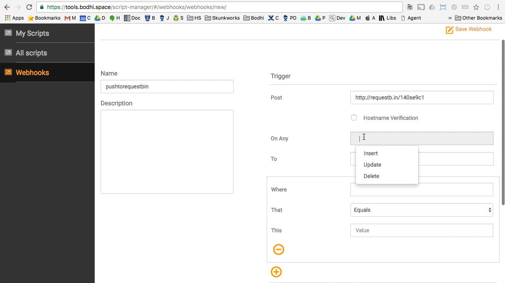

In the **To** field enter the name of the Type you want to watch for inserts. In my example I will watch the **Slog** data type.

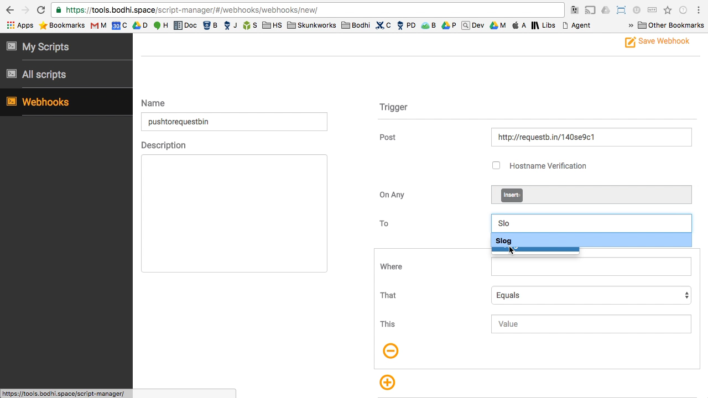

Next select the data filter. We will want the webhook to fire when our type has a data property equal to some value. In this case, we will watch Slog.application. In the **Where** field enter **application** (if you are following my example).

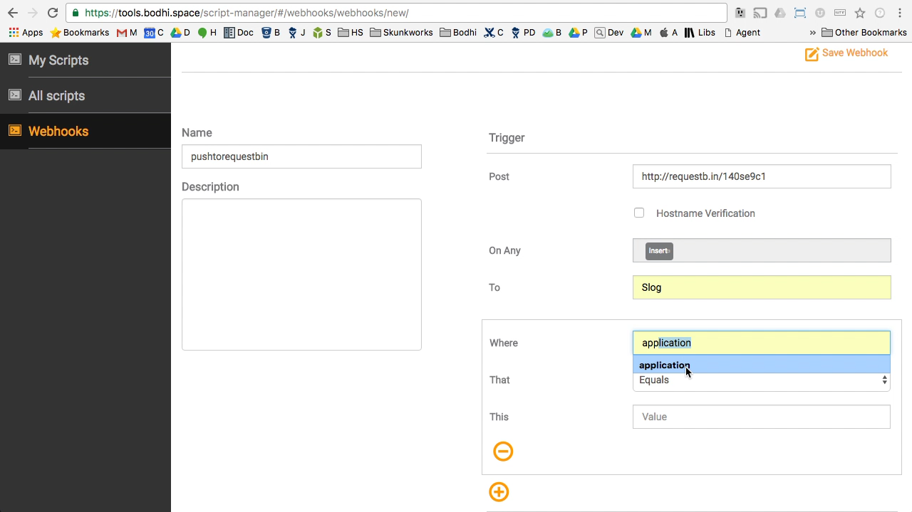

Now set the filter property. In this case we want to fire the webhook when the application name is **Bob**.  In the **This** field enter **Bob**.

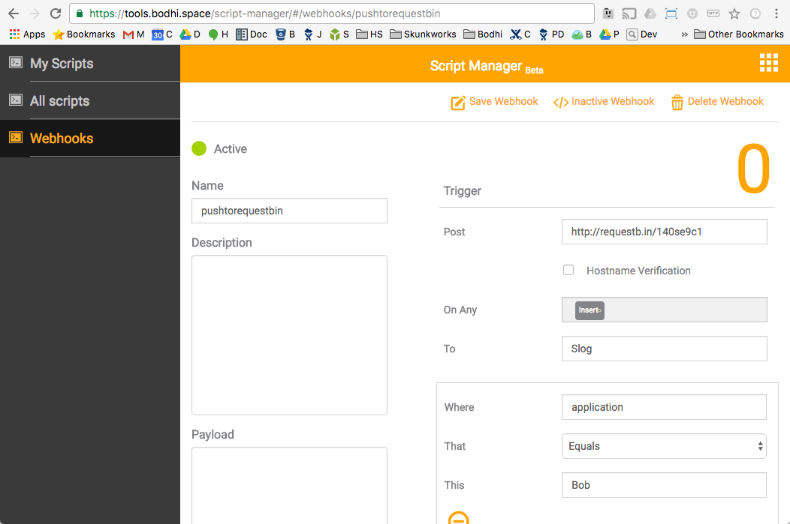

Save the Webhook.

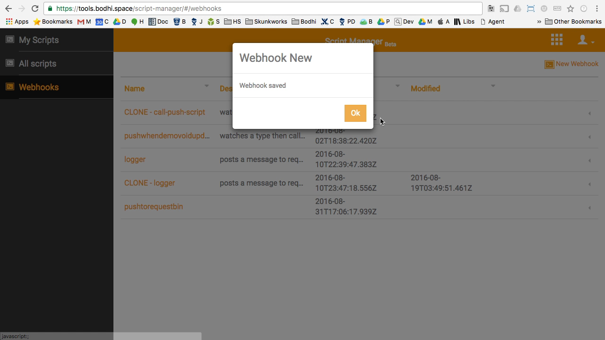

### Step 3 - Trigger the webhook

Navigate to [the Query tool](https://tools.bodhi.space/query/#/).   
Select **POST** from the REST operation drop down.  
Enter the name of the type. If you have been following this example then enter **Slog**.   
In the payload body, fill out the two string fields - setting the **Message** to **Hello World** and the **Application** to **Bob**.   
Press **Send** to post the data to the platform.

This should trigger the webhook. It may take a minute or so to post a message to the endpoint we set up earlier on requestb.in. Navigate to [requestb.in](requestb.in)

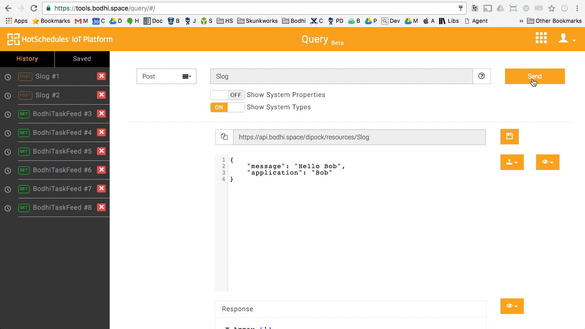

When you refresh the page you should see that the webhook has posted the payload (which defaults to the data type you posted) to the requestb.in endpoint.

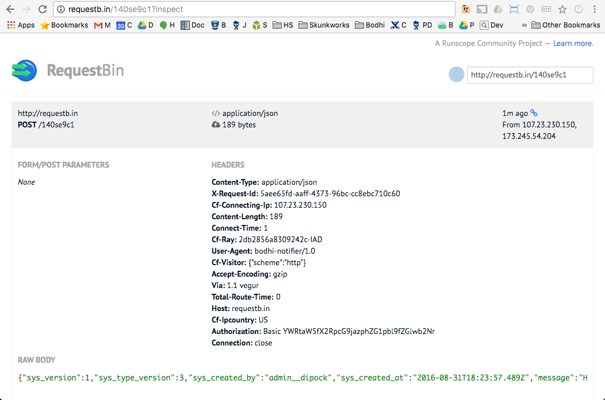


