# Mobile Application Development

In this workshop we will look at the process of mobile application development. 

A Bodhi mobile application is a web application that is deployed and hosted in the Bodhi Cloud. When a user logs onto their device, the mobile application is served up from the Bodhi cloud and delivered and persisted in the users' Bodhi Mobile container. 

The Bodhi mobile container is a the native app that the user installs from the appstore. For simplicity it is referred to as **container** in this workshop.

A Bodhi mobile app is a web application that you write. It is referred to as the **app** in this workshop. 

There are two tasks involved in creating mobile applications:

* creating web applications that run in the Bodhi mobile container
* branding the Bodhi mobile container


## Creating a web application

You will create a web application and deploy it to Bodhi Mobile.


##Prerequisites

**To create a web application you need** 

* a text editor or an IDE
* node.js installed
* bodhi-cli installed

## What is a Bodhi mobile application?

A Bodhi mobile app is a web application and consists of the following assets 

* html file called index.html. It must reside in the root of the app folder   
* a LICENSE file
* any web assets, such as CSS and JS files, can be stored in sub directories
* Bodhi JS file (rbc.js) to access device features
* A package.json file (see <http://docs.bodhi.space/#package.json>)


## Create a mobile app using app-tools cli 


To create a web application we are going to use **app-tools**.

**app-tools** is a command line tool, bundled with **bodhi-cli**, that allows app developers to quickly generate an app and publish it to the cloud so that it can be viewed and executed in the container.

Open your command prompt (select to run as Administrator on Windows)
Navigate to the bodhi project folder you created in Workshop 3. If you did not create a Bodhi project or have not installed the Bodhi CLI - then follow the instructions located here: <http://docs.bodhi.space/#bodhi-command-line-interface>

Follow the instructions to set up a Bodhi project folder using **bodhi init** and set up your **rbc_project.json** file with the environment variables to access your namespace with your credentials. You should read the docs but the steps are as follows:


````
npm install -g bodhi-cli
mkdir bodhiapps
cd bodhiapps
bodhi init  /path/to/new/project/root
bodhi new my_environment_name
bodhi set-default my_environment_name

````

This will create a working folder on your machine and set the CLI to default to your namespace. 

**Example**

Assume our namespace is called 'baybridge' and we want to set up the CLI to use that namespace without having to specify those details every time we wish to converse with the cloud.

````
npm install -g bodhi-cli
mkdir bodhiapps
cd bodhiapps
bodhi init  bodhiapps
bodhi new baybridge -s api.bodhi.space -n baybridge -u susanjones -p ABCDE
bodhi set-default baybridge

````


From the root of your bodhi project folder you should see the following:

* apps - one for your mobile apps 
* models - for any data structures you create
* rbc_project.json file which holds your environment details

Before we create any applications, we will try out some of the features of app-tools. 


>Note: 
most app-tools commands must be executed from the directory of the app you want to create, publish or update.

At any time you can get help on app-tool commands by entering:  

````
app-tools --help
````


To display all the apps currently deployed in the cloud for your specified environment enter:

```
app-tools list-apps [-e -n -u -p]
```

A list of apps currently in the cloud will be displayed. Each app entry will show its meta data. The list may be blank at the moment.


We will use more of the app-tools features during the next exercise.


## Create a mobile app using bodhi-cli


We are going to use app-tools to created these assets for us. It should be noted that you can use any web assets. As long as key files are present and the correct package.json file exists you will be able to deploy applications to Bodhi Cloud.


Navigate to the apps folder. 

Create a new 'blank' app by running the following command: 

````
app-tools new-app <appname>

```` 

Answer the prompts to set the application title and description.

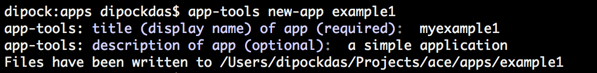

When app-tools has finished creating your mobile project, you can navigate to the project folder and you should see the basic files required for your mobile project.

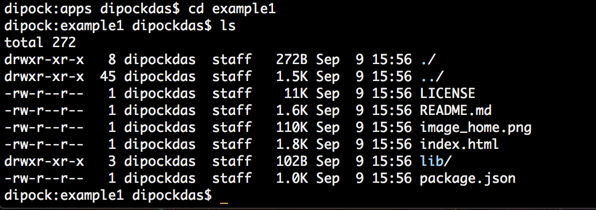

You can edit or enhance the default HTML file or leave the file as-is. 


## Publish your app using bodhi-cli

If it does not exist, create a web publishing folder. By convention this needs to be a folder called www and must sit under the root app folder. So if your app was called **example1** create the www folder in that directory - i.e. **example1/www**.

Copy production ready files into the **www** directory.

To publish your app, enter the following at the command line

>This command must be run in the app folder.

````
app-tools publish-app
```` 

App-tools publishes the app to the namespace specified by the environment variable set in your rbc_project.json file. 

Notes:

* You must have the version, name and title specified in the package.json when publishing (use the app-tools metadata commands and profile commands to set these).
* Only users with the admin profile are allowed to publish apps.
* Max zip file size is 20mb.
* Max number of files is 1024.


Within an application's package.json file, there is a property that contains  metadata about the app which the App Store and mobile container use to properly display the application.


If the application was successfully published, app-tools will inform you and provide details abbout the application. 


## Package.json

The package.json file contains information that is required for the application to run in Bodhi Cloud.

**General info::**

````
{ offline: true,
navigationBar: 'auto',
new_type_required: false,
single_container_app: false,
hide_from_global_store: false,
troubleshooting_url: null,
categories: [Object],
public_path: 'global_store',
screenshots: [Object],
installation_urls: [Object],
global_store_icon: 'global_store/global_store_icon.png' }
````

Use the settings JSON object to communicate the meta data about an app. See definitions below:

**offline=true/false**  
Offline controls whether the container will cache application information for offline use. If offline=true and the user launches the application, any data that was previously loaded will be available when the device is offline. This will also enable queuing of data to write to the Bodhi Cloud if the app has write permissions.

**single_container_app=true/false**  
single_container_app the container know whether the app should be displayed with a menu (a collection of apps) or as a standalone single app.
Bodhi Mobile has single_container_app = false. Bodhi Reveal has single_container_app = true

**installation_urls= {http://tools.bodhi.space/xxxx}
For applications with single_container_app = true, developers can provide a set of installation url's to inform customers where to download their applications from the Google Play, Apple, and Windown stores. Developers can also specifiy a hockeyapp link or any other external URL.

**hide_from_global_store=true/false**  
hide_from_global_store controls whether the app is available to the general public to see in the global app store. Apps like Settings which cannot be removed should have hide_from_global_store=true

**new_type_required=true/false**  
new_type_required tells the installer of the app in the global app store if the app will run 'out of the box' or if new custom types need to be installed on the namespace.
NOTE:: if new_type_required=true, troubleshooting_url should be required

**troubleshooting_url='http://tools.bodhi.space/xxxx'**  
The troubleshooting_url is the URL where the customer can find additional information about how to install custom types on their namespace to get an app to function correctly. This can also be used to FAQ's or any other outbound troubleshooting you would like to provide to your customers.

**categories { }**  
The categories array allows you to give the Bodhi app store taxonomical information about how your app relates to other applications. 
Examples include financial, inventory, mangegement

**public_path'/xxx/xxx'** 
The Public Path is a location off of root that allows developers to save items that should be publically visable and available. The Public Path folder should contain screenshots and Icons that the global app store can use. The global_store_icon as well as the screenshots settings objects should all be relative paths to the public path.

**global_store_icon='/xxx/xxx.png'**  
The global_store_icon is the icon that the Global App Store will use for display purposes. This file should be included in the app folder that is published via app tools and the path should be relative to the public_path.

**screenshots{ }** 
The screenshots array contains relative paths to screenshots which the Global App Store will use for display purposes. This files should be included in the app folder that is published via app tools and the path should be relative to the public_path.


## Access the app on your mobile device

If you have not done so already, install **Bodhi Mobile** from the Apple App Store or Google Play Store.

Log into Bodhi Mobile using your credentials (the same one you used to publish the app to Bodhi Cloud)

You should see your application in an automatically generated menu of available apps from your own private app-store. 

Launch your application by selecting it. If you just used the default application template, you will see a page with a button displayed. While it is not very interesting, you've just gone through the exercise of creating and deploying a mobile app to Bodhi Cloud and using Bodhi's automatic provisioning and deployment to put the app on your mobile phone.


## Create a list-detail app

In the next exercise we will create an app that pulls data from the Bodhi API. We will first show data in a list, and then navigate the user to a detail screen once they tap the list item. It's a simple list-detail app based on the **stores** data type. You will specify the type name when running the app-tools command. The app will list the 20 most recent records for the specified type. The user can then drill down and see the record in more detail. 

Applications must include a profile to describe the data type the app will access and the type of access required - whether select, insert, update or delete - or a combination there of. 

>Note: app-tools will auotmatically create the **access profile** for your data type - but you must specify the access required.

When using the app-generator template option, the **store type** with the **select** action will be added to the profile definition upon app creation.

We will use the following app-tools command to create our list detail app

````
app-tools new-app <app-name> -t app-generator -m <type name> [meta-data-options] [env-options]
````

Navigate to your apps folder. We will create a new app with a new project folder. 

> Because this command uses a type that exists in the Bodhi repository, you must have an internet connection to run this command. app-tools will query the type definition via the Bodhi API

At the command prompt enter

````
app-tools new-app storelist -t app-generator -m Stores
```` 

app-tools should create your new project folder and populate it with a sample application. Navigate to the **apps/storelist** project folder.

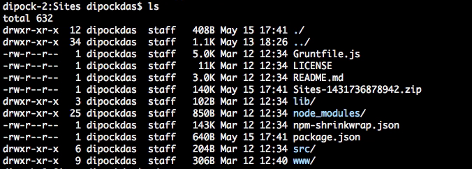

If it does not exist, create the web publishing folder, called **www**. 

Copy your production ready files into the **www** directory.

To publish your app, enter the following at the command line


````
app-tools publish-app
````

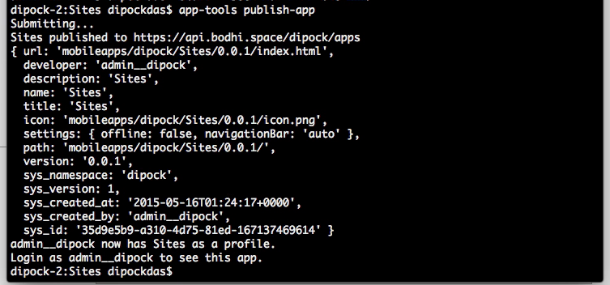


To access the app on your device, log out of Bodhi Mobile and then login again. This will force Bodhi mobile to check the cloud API to see if there are any new apps available and download them to your device.

Launch your new application. 

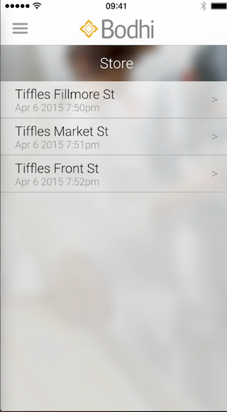

Presuming you have defined some stores, you should see a list of Stores in your mobile app. Select an item from the list. 

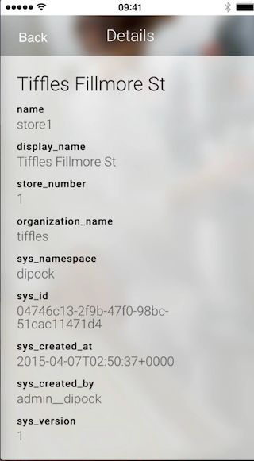

The app will navigate to the detail screen.

For development of app content and any feature that does not require mobile device access, you can view and test the app in your browser. Use the [API ENDPOINT]/apps/[APP NAME]/index.html path displayed when you deployed the application to Bodhi. 

> you need to be logged in as a user that has been given access to the app


## Publish your app using Bodhi Shop

You can upload your app using Bodhi Shop.

Navigate to your web application folder

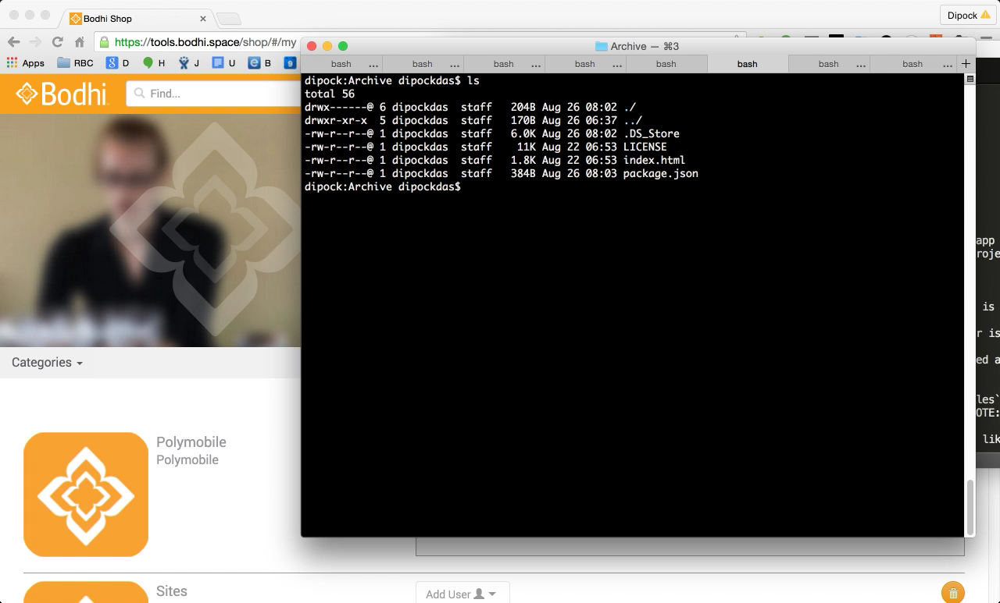

Zip the contents of the folder

<!--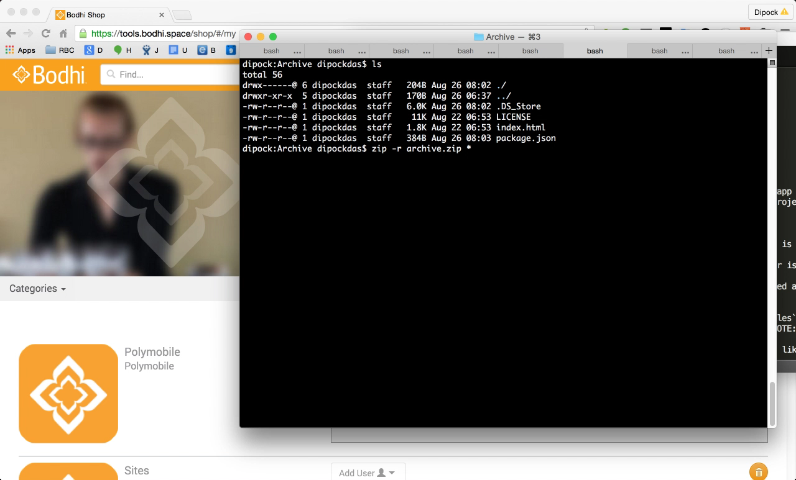-->


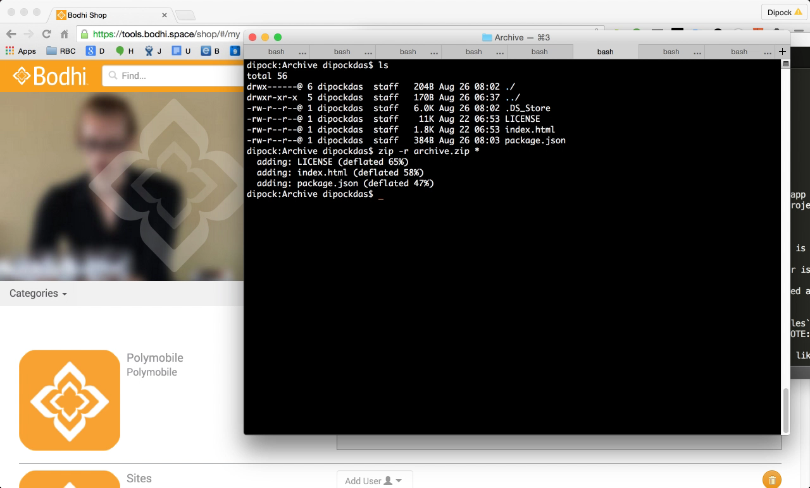

From your desktop browser, log into Bodhi Tools at https://tools.bodhi.space/. 

Scroll down to Bodhi Shop and click to launch.


From the my Mobile apps page click 'Publish App'


<!--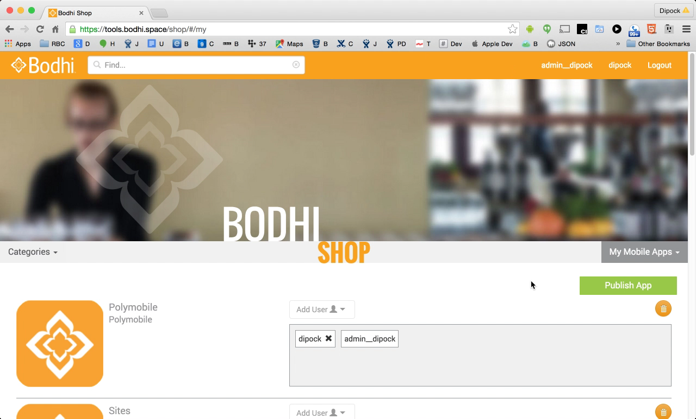-->


From the dialog click Choose file

<!---->

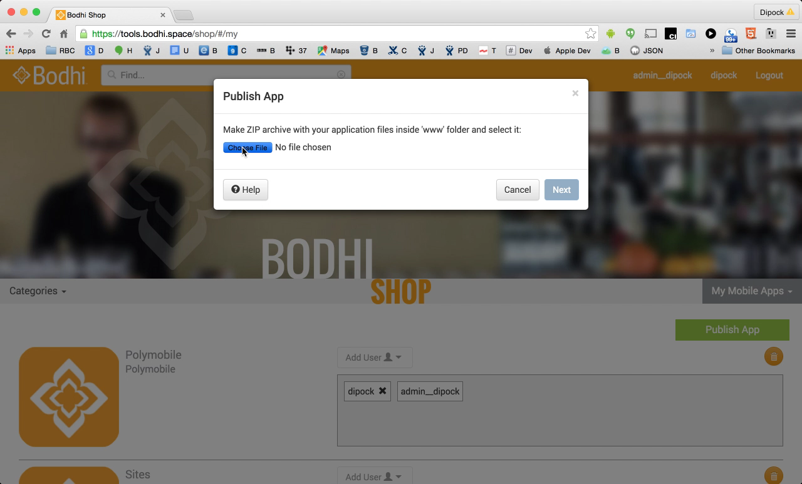

Navigate to the folder where the archive is located.
Select the file.

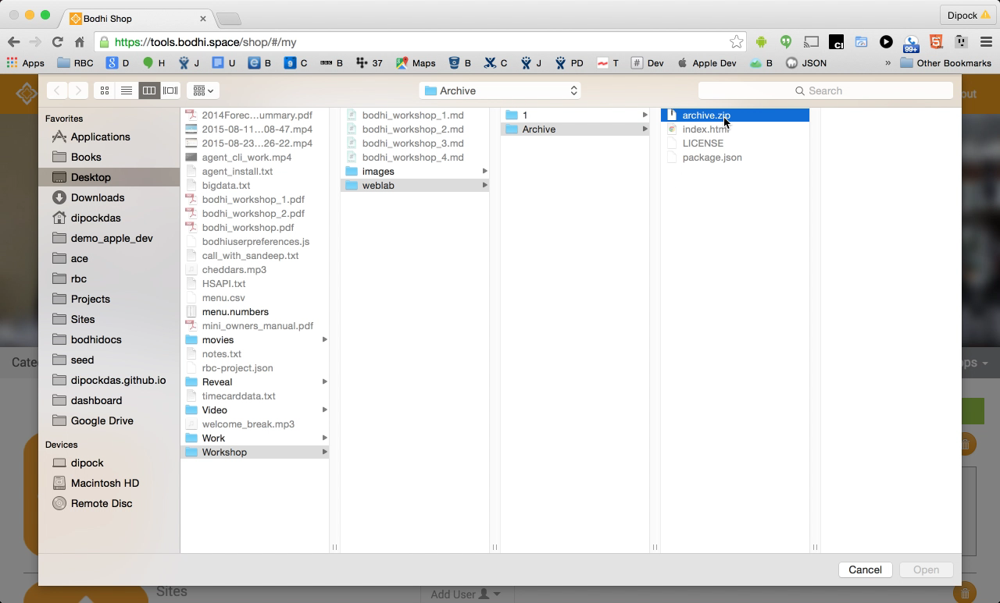

Click Next.

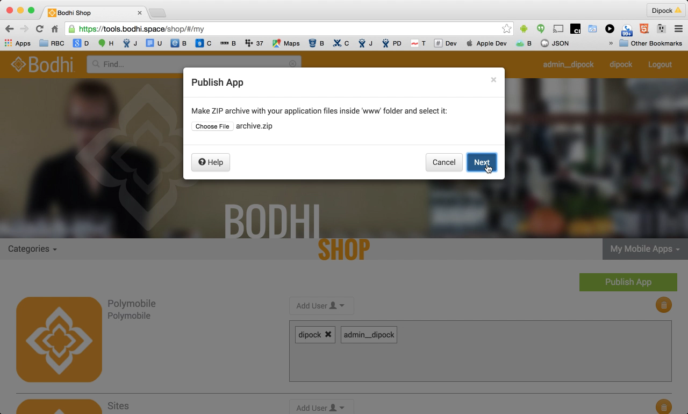

Review the metadata for the app. Then click 'Publish'

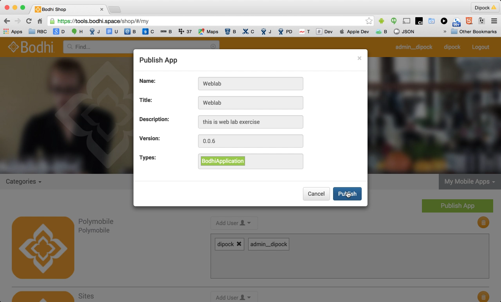

The app will be uploaded and stored in the Bodhi Cloud in a type called Application.

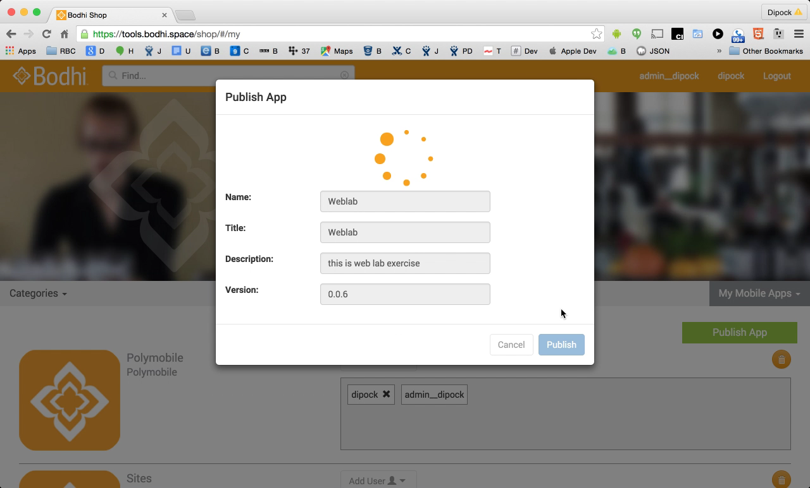

Click Open App.

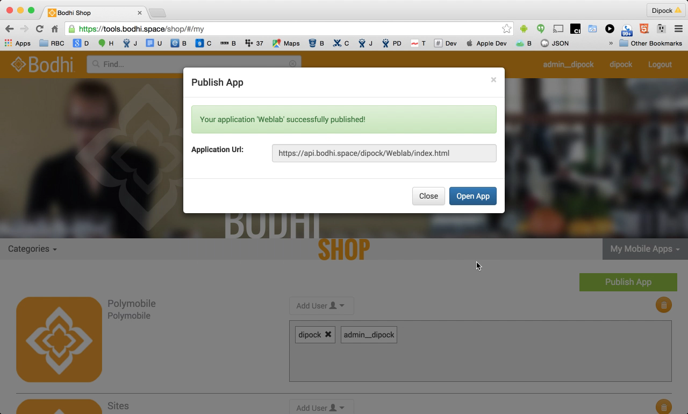

Now you can see that your app has been installed in your namespace. By default, all apps are added with one user assigned - this is the user who uploaded the app. 
 
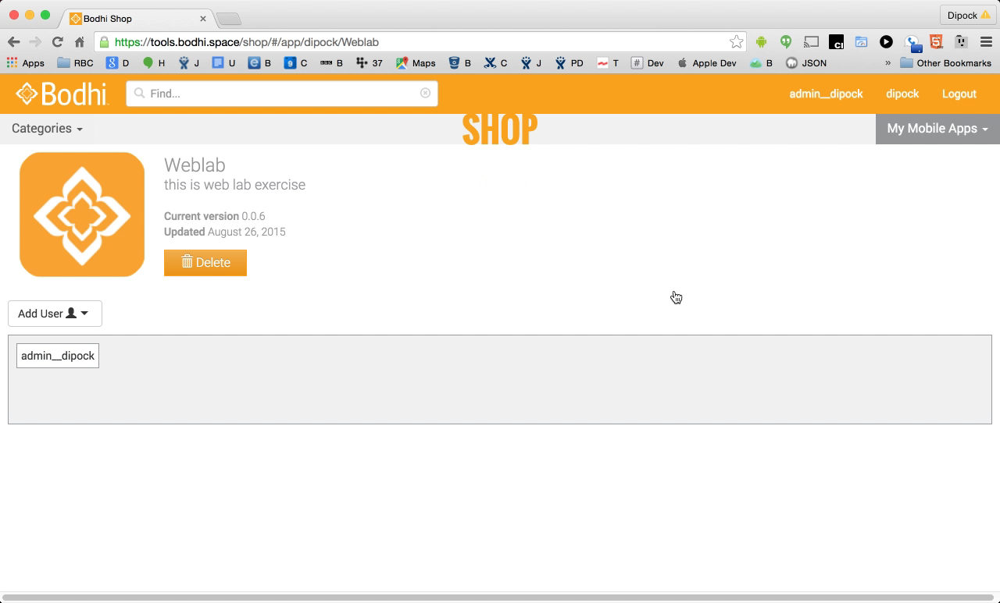

To add more users to the account click the **Add User** drop down and select the users that require access to this application. 

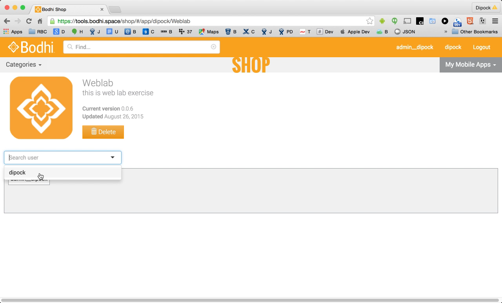

And you're done. Now you can open your phone and look at your application.

<!--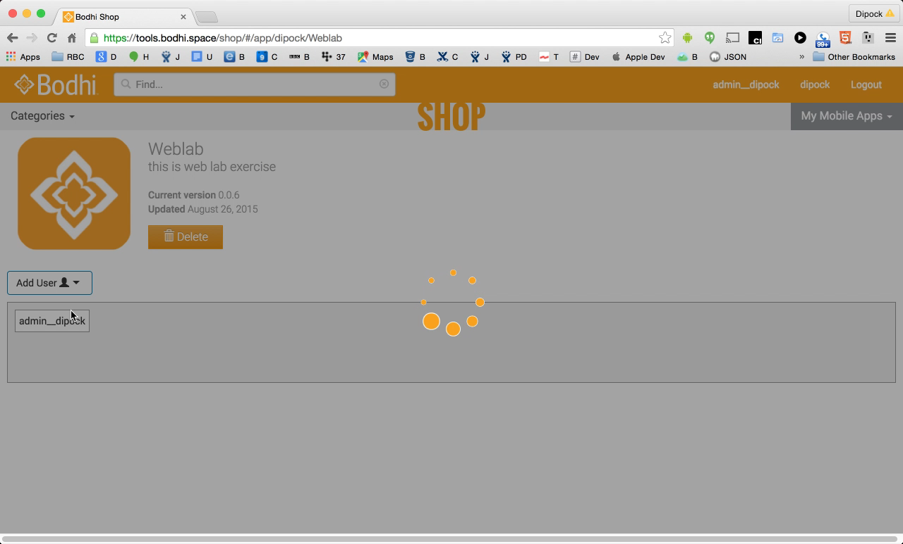-->
<!--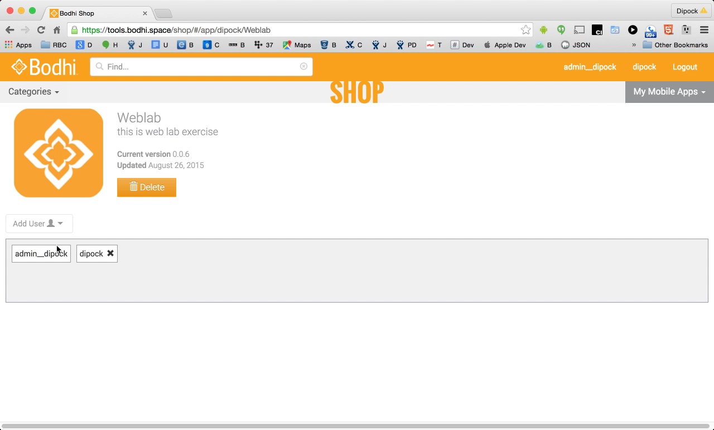-->
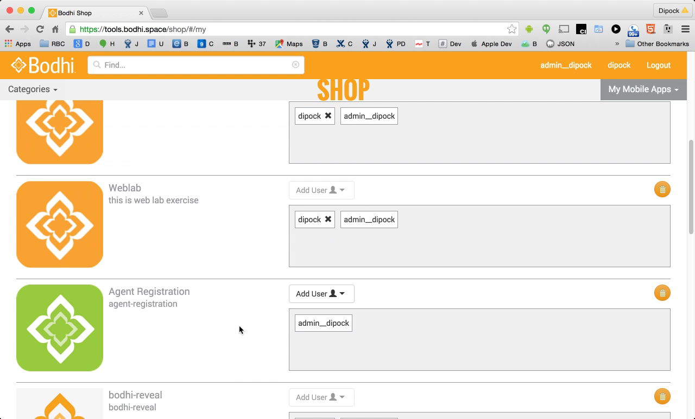


For errors or feedback with any of these labs please contact support@hotschedules.com


